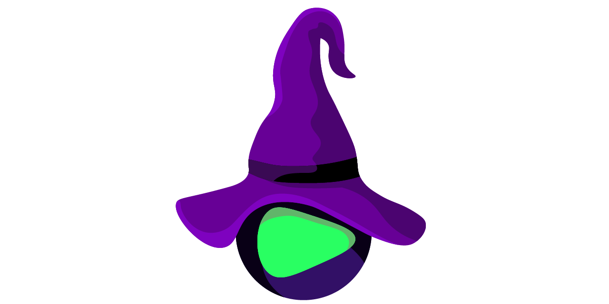

# ReplayWizard

ReplayWizard is a powerful automation tool designed to streamline your workflow by capturing and replaying your 
interactions with your computer 

You can find **Full Project Documentation** [here][documentation_path]



<hr>

#### Workflows
[](https://github.com/quillcraftsman/replay-wizard/actions/workflows/run-tests.yml)
[](https://github.com/quillcraftsman/replay-wizard/actions/workflows/lint.yml)

#### Package
[](https://pypi.python.org/pypi/pygenesis/)
[](https://pypi.python.org/pypi/pygenesis)
[](https://pypi.python.org/pypi/pygenesis/)
[](https://github.com/quillcraftsman/replay-wizardblob/main/LICENSE)
[](https://pypi.python.org/pypi/pygenesis/)

#### Support
[][documentation_path]
[](https://github.com/quillcraftsman/replay-wizard/discussions/)
[](https://github.com/quillcraftsman/replay-wizard/issues/)

#### Downloads
[](https://pepy.tech/project/pygenesis)
[](https://pepy.tech/project/pygenesis)
[](https://pepy.tech/project/pygenesis)
[](https://pepy.tech/project/pygenesis)

#### Languages
[](https://github.com/quillcraftsman/replay-wizard)
[](https://github.com/quillcraftsman/replay-wizard)

#### Development
- [](https://github.com/quillcraftsman/replay-wizard/releases)
[](https://github.com/quillcraftsman/replay-wizard)
- [](https://github.com/quillcraftsman/replay-wizard/issues/)
[](https://github.com/quillcraftsman/replay-wizard/issues/)
- [](https://github.com/quillcraftsman/replay-wizard/pulls)
[](https://github.com/quillcraftsman/replay-wizard/pulls)
- [](https://github.com/quillcraftsman/replay-wizard/discussions/)

[//]: # (#### Repository Stats)

[//]: # ([![Stars]&#40;https://img.shields.io/github/stars/quillcraftsman/replay-wizard)

[//]: # (&#41;]&#40;https://github.com/quillcraftsman/replay-wizard&#41;)

[//]: # ([![Contributors]&#40;https://img.shields.io/github/contributors/quillcraftsman/replay-wizard)

[//]: # (&#41;]&#40;https://github.com/quillcraftsman/replay-wizardgraphs/contributors&#41;)

[//]: # ([![Forks]&#40;https://img.shields.io/github/forks/quillcraftsman/replay-wizard)

[//]: # (&#41;]&#40;https://github.com/quillcraftsman/replay-wizard&#41;)

<hr>

## Menu

- [Mission](#mission)
- [Open Source Project](#open-source-project)
- [Features](#features)
- [Requirements](#requirements)
- [Development Status](#development-status)
- [Install](#install)
- [Quickstart](#quickstart)
- [Contributing](#contributing)

## Mission

Unlock Efficiency, Replay Your Moves.

Whether you're performing repetitive tasks, testing software, or demonstrating procedures, 
ReplayWizard empowers you to record your actions effortlessly and replay them with precision.

With ReplayWizard, you can automate complex sequences of mouse clicks, keyboard inputs, window movements, and application launches, 
saving you time and effort. Simply initiate the recording, perform your actions as usual, and let ReplayWizard handle the rest.

ReplayWizard offers flexibility and customization, allowing you to edit and refine your recorded actions, adjust playback speed,
and schedule automated tasks for optimal efficiency. Its intuitive interface makes it accessible to users of all levels, 
from beginners to experienced professionals.

## Open Source Project

This is the open source project with [MIT license](LICENSE). 
Be free to use, fork, clone and contribute.

## Features

This features will be built during 4 weeks.
20.03.2024 - deadline

- Capture mouse actions
- Save mouse actions
- Replay mouse actions
- Capture keyboards actions
- Save keyboards actions
- Replay keyboards actions
- Capture environment 
- Save environment 
- Replay environment
- Console script
- python library API

## Requirements

- python (library was tested with **3.10**, **3.11** versions)
- pynput (this package use [LGPL-3.0 license](https://github.com/moses-palmer/pynput/blob/master/COPYING.LGPL) and used in this project as a third party library without modifications)

See more in [Full Documentation](https://replaywizard.org/about.html#requirements)

## Development Status

- Package available soon on [PyPi](https://pypi.org/project/replay-wizard/)

See more in [Full Documentation](https://replaywizard.org/about.html#development-status)

## Install

### with pip

```commandline
pip install replay-wizard
```

See more in [Full Documentation](https://replaywizard.org/install.html)

## Quickstart

```python
from replay_wizard import info

print(info())
```

### More examples in [Full Documentation][documentation_path]

## Contributing

You are welcome! To easy start please check:
- [Full Documentation][documentation_path]
- [Contributing](CONTRIBUTING.md)
- [Developer Documentation](https://replaywizard.org/dev_documentation.html)
- [Code of Conduct](CODE_OF_CONDUCT.md)
- [Security Policy](SECURITY.md)
- [Governance](GOVERNANCE.md)
- [Support](SUPPORT.md)

[documentation_path]: https://replaywizard.org